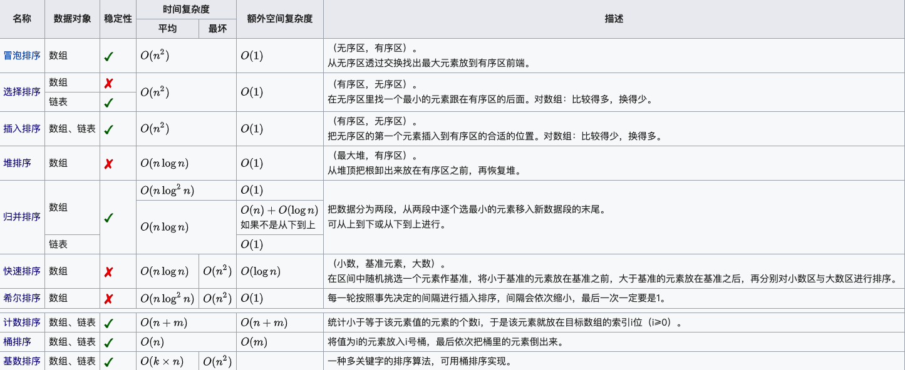

# 排序算法对比表

| 排序算法 | 平均时间复杂度 | 最好情况时间复杂度 | 最坏情况时间复杂度 | 空间复杂度 | 稳定性 |
| --- | --- | --- | --- | --- | --- |
| 冒泡排序 | $O(n^2)$ | $O(n)$ | $O(n^2)$ | $O(1)$ | 稳定 |
| 选择排序 | $O(n^2)$ | $O(n^2)$ | $O(n^2)$ | $O(1)$ | 不稳定 |
| 插入排序 | $O(n^2)$ | $O(n)$ | $O(n^2)$ | $O(1)$ | 稳定 |
| 希尔排序 | $O(n\log n)$ | $O(n\log^2n)$ | $O(n\log^2n)$ | $O(1)$ | 不稳定 |
| 归并排序 | $O(n\log n)$ | $O(n\log n)$ | $O(n\log n)$ | $O(n)$ | 稳定 |
| 快速排序 | $O(n\log n)$ | $O(n\log n)$ | $O(n^2)$ | $O(\log n)$ | 不稳定 |
| 堆排序 | $O(n\log n)$ | $O(n\log n)$ | $O(n\log n)$ | $O(1)$ | 不稳定 |
| 计数排序 | $O(n+k)$ | $O(n+k)$ | $O(n+k)$ | $O(k)$ | 稳定 |
| 桶排序 | $O(n+k)$ | $O(n+k)$ | $O(n^2)$ | $O(n+k)$ | 稳定 |
| 基数排序 | $O(n\times k)$ | $O(n\times k)$ | $O(n\times k)$ | $O(n+k)$ | 稳定 |

**名词解释**：

- $n$：数据规模
- $k$：桶数量
- 稳定性：任意两个元素排序前后的顺序相同

## 排序算法对比表 Wiki

